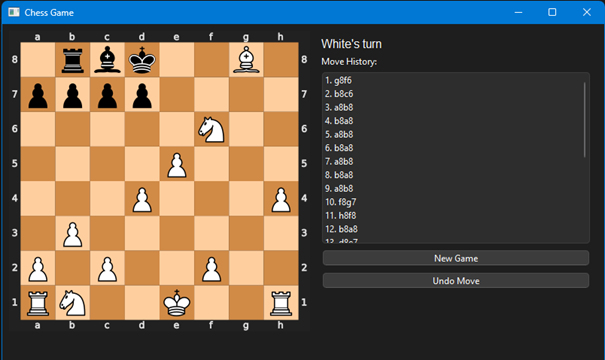
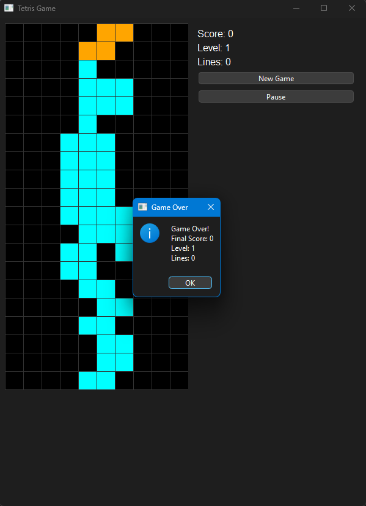

# Reinforcement Learning Algorithms

This project contains reinforcement learning implementations for different games.

### Training

```bash
python src/training/train_chess.py
python src/training/train_tetris.py
```

### Testing

Chess:
```bash
python src/testing/play_chess.py --model_path data/checkpoints/chess_model.pth
```

<div align="center">
  
  <p><em>Interactive Chess GUI with move history and game controls</em></p>
</div>

Tetris:
- Arrow keys for movement and rotation
- Space for hard drop
```bash
python src/testing/play_tetris.py # play yourself
python src/testing/play_tetris.py --model_path data/checkpoints/tetris_model.pth # let AI play
```

<div align="center">
  
  <p><em>Interactive Tetris GUI</em></p>
</div>